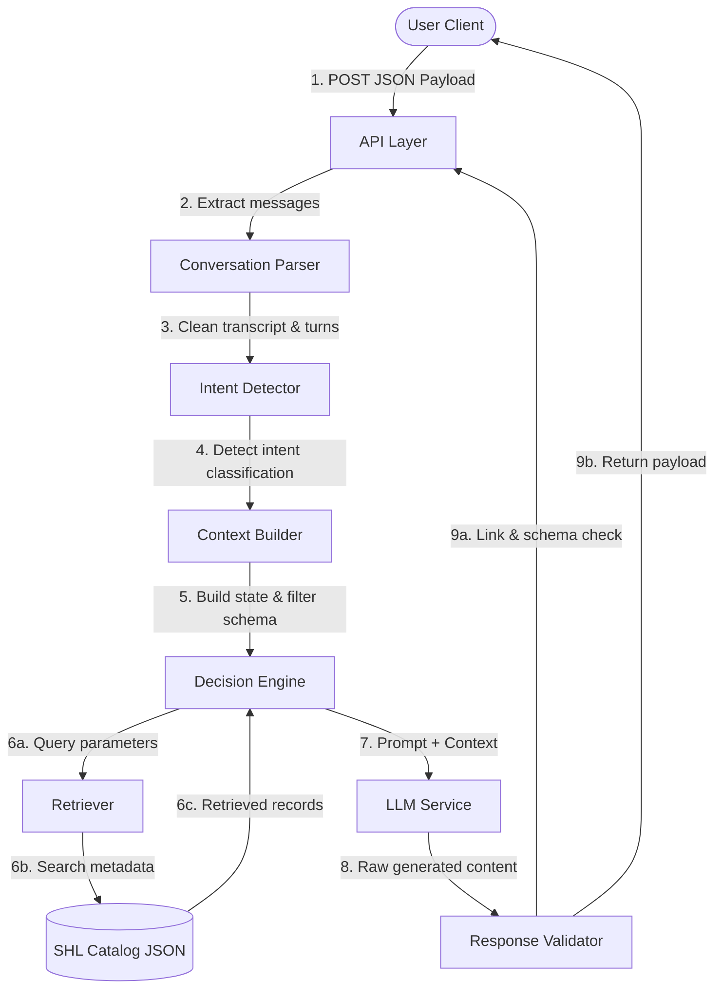
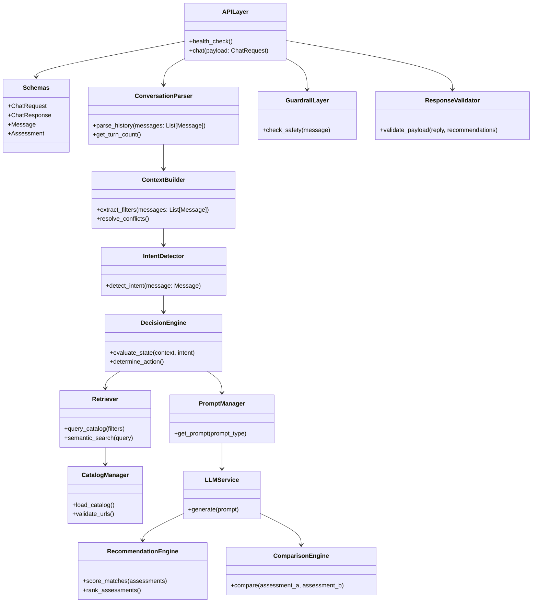
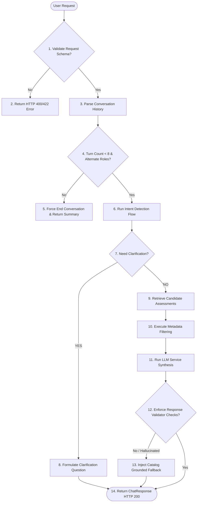
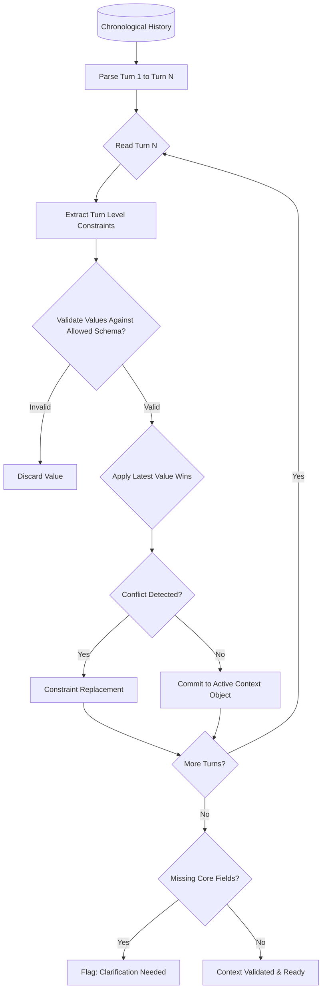
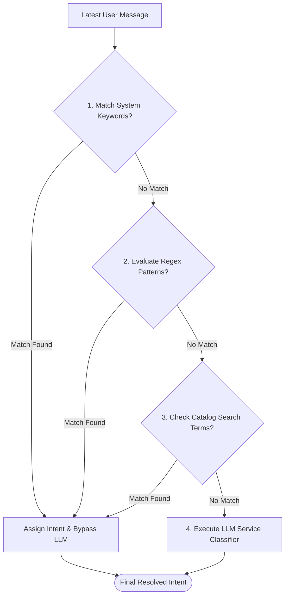
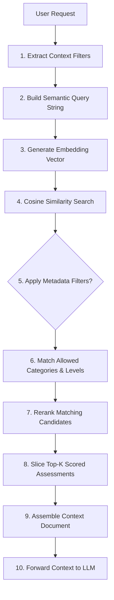
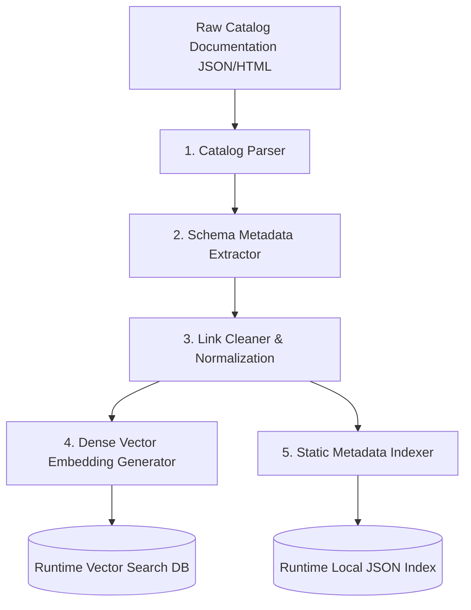
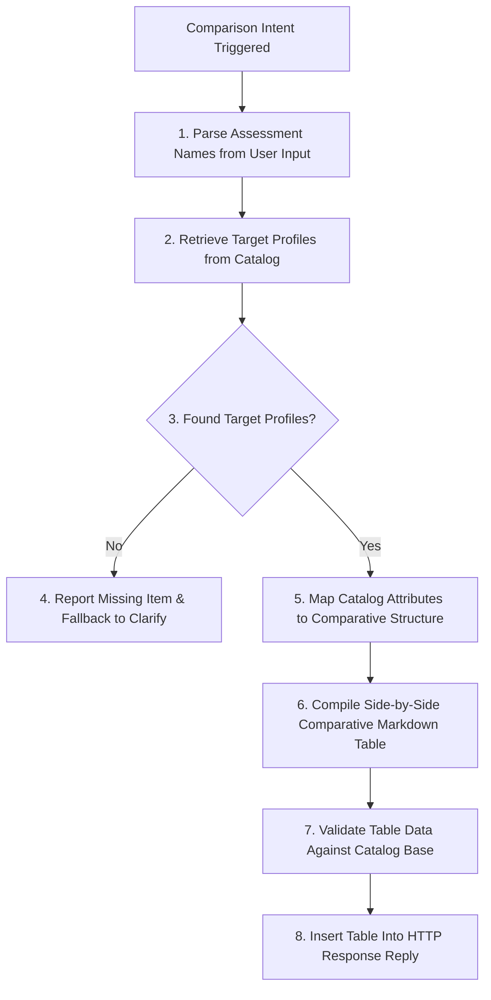
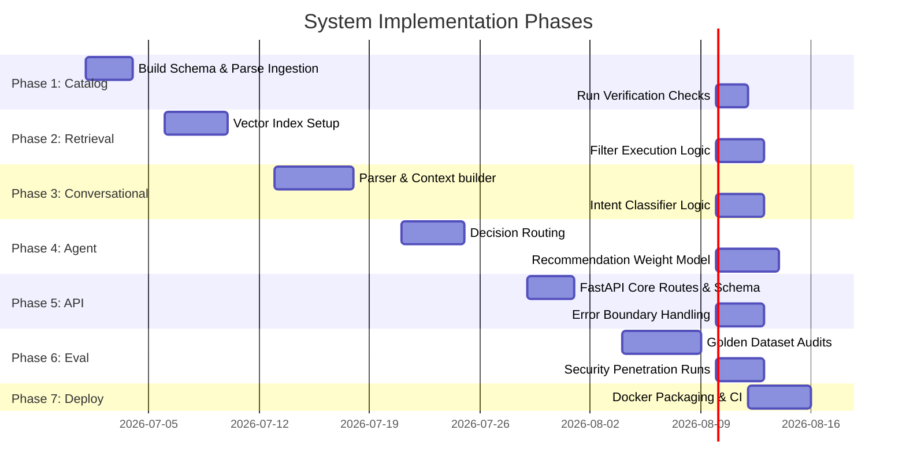

# Software Requirements Specification (SRS)
## Project: Conversational SHL Assessment Recommender

**Document Version:** 3.0.0  
**Date:** July 1, 2026  
**Status:** Frozen Implementation Specification  
**IEEE Std 830-1998 Compliant Structure**

---

## 1. Executive Summary

The **Conversational SHL Assessment Recommender** is an artificial intelligence solution designed to assist recruiters and hiring managers in discovering suitable candidate assessment tools. Rather than acting as a static keyword-based search engine, the system functions as a consultative virtual talent acquisition specialist. Through natural, multi-turn dialogue, the agent assesses the user's specific hiring needs, probes for context, refines constraints, and recommends tailored assessments directly from the official SHL Individual Test Solutions catalog.

To ensure deterministic behavior, high reliability, and data privacy, the application backend is built using FastAPI and enforces a stateless architecture. Every API call contains the entire conversation history, eliminating the need for server-side conversation state storage. By constraining recommendations exclusively to a validated offline local index of SHL's catalog, the system eliminates LLM hallucinations, ensuring every recommended test exists, is active, and links to an official SHL source.

---

## 2. Problem Statement

Recruiters, HR partners, and hiring managers face significant challenges in navigating the vast and highly specialized SHL assessment portfolio. The catalog contains hundreds of Individual Test Solutions (e.g., OPQ, GSA, coding tests, verbal reasoning, personality batteries) spanning different roles, candidate experience levels, languages, and competencies.

The primary issues in the current discovery workflow include:
*   **Terminology Barrier:** Recruiters often do not understand the underlying psychometric or technical classification of tests (e.g., the difference between cognitive tests and behavioral batteries).
*   **Vague Requirements:** Initial queries from recruiters are frequently ambiguous (e.g., "I need a test for my new recruits"), which keyword-based search engines cannot resolve without extensive manual filtering.
*   **Risk of Recommendation Inaccuracy:** Using generalized LLMs to search for SHL assessments leads to hallucinations of non-existent tests, broken links, or recommendations that violate compliance and validation standards.
*   **Friction in Discovery:** Identifying, comparing, and selecting tests requires pivoting between search pages, PDF brochures, and static comparison tables, leading to high friction and potential drop-offs.

---

## 3. Project Objectives

The project aims to achieve the following core objectives:
*   **Intelligent Probing:** Build a conversational system that detects vague requirements and actively asks clarifying questions to narrow down the job family, candidate seniority, and assessment intent.
*   **Zero-Hallucination Recommendations:** Deliver recommendations derived strictly from a validated, scraped index of the SHL Individual Test Solutions catalog.
*   **Stateless API Architecture:** Implement a high-performance, stateless FastAPI backend processing complete conversation histories under a strict latency SLA of 30 seconds per request.
*   **Context-Aware Dialog Control:** Support mid-conversation refinements, direct multi-assessment comparisons, out-of-domain refusals, and conversation termination within a strict limit of 8 turns.

---

## 4. Business Goals

*   **Accelerate Assessment Discovery:** Reduce the average time a recruiter spends identifying the correct assessment from hours of catalog browsing to under 2 minutes of natural conversation.
*   **Increase Self-Service Conversion:** Enable non-technical recruiters to self-diagnose and select complex psychometric and skill assessments, increasing test utilization rates.
*   **Lower Support Overhead:** Reduce the volume of support tickets and consultative inquiries directed at SHL's sales and customer support teams regarding basic test selection.
*   **Enhance Brand Experience:** Establish a state-of-the-art, consultative brand touchpoint that showcases technological leadership in the assessment space.

---

## 5. Scope

The scope of the Conversational SHL Assessment Recommender system includes the following components:
*   **FastAPI Backend Service:** An API supporting two primary endpoints: `GET /health` and `POST /chat`.
*   **Dialogue Orchestration & State Tracking:** Logic to reconstruct conversation state, filter context, and manage turn counts from incoming conversation history.
*   **Retrieval-Augmented Generation (RAG) Engine:** Search mechanics to retrieve matching assessments from the indexed SHL catalog based on extracted hiring criteria.
*   **Prompt Injection and Guardrail Layer:** System logic to detect and refuse out-of-scope inquiries (e.g., legal or HR compliance advice, jailbreak attempts) and redirect back to assessment recommendation.
*   **Catalog Indexing Pipeline (Offline):** Tools and scripts to scrape, structure, validate, and index the SHL Individual Test Solutions catalog into a high-fidelity reference database.

---

## 6. Out of Scope

The following features, integrations, and capabilities are explicitly excluded from this project:
*   **Pre-packaged Job Solutions:** Multi-test bundles pre-configured for specific job roles (e.g., "Customer Service Representative Solution"). The system must only recommend "Individual Test Solutions."
*   **User Authentication & Session Management:** The backend will not handle user registration, logins, or server-side session persistence.
*   **Conversation Databases:** No database (SQL, NoSQL, or cache) will be implemented to store conversation history on the server.
*   **Candidate Administration & Testing Portal:** The system will not administer tests to candidates, send test invites, or process candidate test scores.
*   **Real-time Web Scraping:** The system will not perform active web scraping or external API calls to SHL's website during a live chat turn. All retrieval must occur against the offline local index.

---

## 7. Target Users

The primary users of the system are categorized as:
*   **Corporate Recruiters:** HR professionals responsible for screening candidates across various departments. They require fast, role-specific screening tests.
*   **Talent Acquisition Directors:** Strategic HR leaders who select standardized, high-volume assessments (e.g., personality or general cognitive tests) for annual graduate hiring programs.
*   **Hiring Managers:** Department heads looking for technical or functional assessments to evaluate specialized skills.
*   **HR Consultants:** Advisors seeking psychometrically valid tools (e.g., OPQ) for leadership development or restructuring assessments.

---

## 8. High-Level System Architecture

The following block diagram illustrates the end-to-end data flow for a single `POST /chat` request:



### 8.1 Architectural Description
1.  **API Layer:** Exposes the API endpoint, enforces HTTP parsing, and executes the core asynchronous request lifecycle.
2.  **Conversation Parser:** Unpacks the stateless payload, audits the alternating user/assistant structure, and counts the current turns.
3.  **Intent Detector:** Classifies the latest user turn into one of the supported conversational intents (e.g., Clarification, Comparison, Recommendation).
4.  **Context Builder:** Runs a "latest value wins" heuristic over the historical messages to construct the active filter criteria.
5.  **Decision Engine:** Determines whether the current state requires prompting for clarification, executing a search query, comparing retrieved assessments, or refusing an out-of-domain request.
6.  **Retriever:** Interacts with the offline database containing the indexed SHL catalog, performing metadata filtering and keyword/semantic matching.
7.  **LLM Service:** Formulates prompt contexts and executes calls to the configured LLM backend using structured JSON output configurations.
8.  **Response Validator:** Inspects the generated output to ensure recommended URLs exist in the database and match the output JSON schema contract.

### 8.2 Architectural Separation of Responsibilities
> [!IMPORTANT]
> **LLM Architectural Responsibility**
> The `LLM Service` is strictly a reasoning and natural language synthesis engine. It **never** performs direct database queries or catalog searches. The `Retriever` is solely responsible for searching, filtering, and locating catalog data. The `LLM Service` only processes and reasons over the documents retrieved and provided to it by the `Retriever`. The `Response Validator` intercepts the LLM output and validates that every URL and assessment name matches the verified offline catalog database before returning the payload to the API Layer, guaranteeing that no hallucinated tests or broken links are sent to the user.

---

## 9. Low-Level Architecture

The class diagram below documents the interface definitions and structural dependencies between modules:



### 9.1 API Layer (`api/`)
*   **Purpose:** Exposes HTTP endpoints and manages request-response routing.
*   **Responsibilities:** Handles incoming HTTP request serialization, invokes the validation schemas, tracks execution time, and routes output payloads.
*   **Inputs:** `FastAPI.Request` object containing HTTP headers and JSON bodies.
*   **Outputs:** HTTP response payloads (JSON) or standard HTTP error codes (400, 422, 500).
*   **Dependencies:** `Schemas`, `ConversationParser`, `GuardrailLayer`, `ResponseValidator`.
*   **Error Handling:** Catches validation errors and system exceptions, returning formatted JSON errors matching standard schemas.

### 9.2 Schemas (`schemas/`)
*   **Purpose:** Defines request and response validation structures.
*   **Responsibilities:** Enforces JSON structural contracts, validates data types, and whitelists incoming fields.
*   **Inputs:** Raw JSON inputs.
*   **Outputs:** Pydantic validation models (`ChatRequest`, `ChatResponse`, `Message`, `Assessment`).
*   **Dependencies:** None.
*   **Error Handling:** Throws validation errors on type mismatch or missing fields.

### 9.3 Conversation Parser (`agent/parser.py`)
*   **Purpose:** Decodes the input conversational array.
*   **Responsibilities:** Extracts user messages, counts conversational turn loops, and verifies alternating dialog patterns.
*   **Inputs:** Array of `Message` models.
*   **Outputs:** Cleaned message list, integer turn count.
*   **Dependencies:** `Schemas`.
*   **Error Handling:** Throws custom errors if alternating dialogue roles are violated.

### 9.4 Context Builder (`agent/context.py`)
*   **Purpose:** Reconstructs the search metadata context from stateless chat history.
*   **Responsibilities:** Tracks constraints, resolves contradictions, and determines search parameter values.
*   **Inputs:** Chronological list of user messages.
*   **Outputs:** `MetadataFilters` object (e.g., job family, experience level, test modality).
*   **Dependencies:** `Schemas`.
*   **Error Handling:** Resets conflicted keys to the latest user selection and returns a valid filters object.

### 9.5 Decision Engine (`agent/decision.py`)
*   **Purpose:** Determines the operational action required for the current conversational step.
*   **Responsibilities:** Evaluates extracted filters, intents, and turn counts to select the next state (Clarify, Retrieve, Compare, Refuse, or Terminate).
*   **Inputs:** Current turn count, extracted filters, detected intent.
*   **Outputs:** Target routing instruction (action enum).
*   **Dependencies:** None.
*   **Error Handling:** Defaults to `Action.CLARIFY` if context is ambiguous or unresolvable.

### 9.6 Retriever (`retriever/core.py`)
*   **Purpose:** Queries the indexed SHL catalog.
*   **Responsibilities:** Performs metadata filtering and key term matching against the offline index.
*   **Inputs:** Search parameters, query strings.
*   **Outputs:** List of raw catalog records matching constraints.
*   **Dependencies:** `CatalogManager`.
*   **Error Handling:** Returns empty lists on database/file system read issues, logging exceptions.

### 9.7 Catalog Manager (`catalog/manager.py`)
*   **Purpose:** Loads, caches, and verifies the static catalog.
*   **Responsibilities:** Loads the structured JSON catalog into memory, parses schemas, and acts as the local index data source.
*   **Inputs:** None (loads path from environment configuration).
*   **Outputs:** Complete list of whitelisted `Assessment` models.
*   **Dependencies:** `Schemas`, `Configuration`.
*   **Error Handling:** Throws fatal startup errors if the database file is missing or corrupted.

### 9.8 Prompt Manager (`prompts/manager.py`)
*   **Purpose:** Manages template rendering for the LLM.
*   **Responsibilities:** Retrieves system and contextual prompts, filling template variables with retrieved data and user queries.
*   **Inputs:** Active templates name and value dictionaries.
*   **Outputs:** Rendered text prompts ready for execution.
*   **Dependencies:** None.
*   **Error Handling:** Throws exceptions if required template keys are missing.

### 9.9 LLM Service (`llm/service.py`)
*   **Purpose:** Interfaces with the external Large Language Model.
*   **Responsibilities:** Packages system requests, executes calls, forces structured outputs, and retries failed calls.
*   **Inputs:** Rendered prompts, optional temperature parameters.
*   **Outputs:** Raw LLM generated strings or JSON data blocks.
*   **Dependencies:** `Configuration`.
*   **Error Handling:** Executes retry algorithms and throws downstream service errors on timeout or rate limit exhaustion.

### 9.10 Recommendation Engine (`agent/recommendation.py`)
*   **Purpose:** Filters, ranks, and matches assessments against requirements.
*   **Responsibilities:** Evaluates catalog assessments against target preferences using priority ranking metrics.
*   **Inputs:** Unstructured requirements and candidate catalog documents.
*   **Outputs:** Structured array of 1 to 10 matching `Assessment` recommendations.
*   **Dependencies:** `Schemas`.
*   **Error Handling:** Returns an empty array if match relevance falls below a set similarity threshold.

### 9.11 Comparison Engine (`agent/comparison.py`)
*   **Purpose:** Compiles comparative attributes of candidate tests.
*   **Responsibilities:** Builds comparative markdown tables comparing target audience, duration, languages, and competencies.
*   **Inputs:** List of target assessment objects.
*   **Outputs:** Formatted Markdown comparison table.
*   **Dependencies:** None.
*   **Error Handling:** Formats a fallback text explanation if assessment metadata is incomplete.

### 9.12 Guardrail Layer (`agent/guardrails.py`)
*   **Purpose:** Filters out-of-scope inquiries and injection attempts.
*   **Responsibilities:** Scans messages for trigger phrases, system prompt override requests, and out-of-domain keywords.
*   **Inputs:** Raw user message string.
*   **Outputs:** Boolean safety status, override action instruction.
*   **Dependencies:** None.
*   **Error Handling:** Safely flag unsafe requests, logging attempts.

### 9.13 Response Validator (`agent/validator.py`)
*   **Purpose:** Audits the final JSON response payload.
*   **Responsibilities:** Validates generated URLs against the catalog database, validates the schema structure, and constructs the API response object.
*   **Inputs:** Reply string, matching recommendations list, end of conversation flag.
*   **Outputs:** Enforced `ChatResponse` payload.
*   **Dependencies:** `Schemas`, `CatalogManager`.
*   **Error Handling:** Trims invalid recommendation lists and forces empty array fallbacks if URL mismatch occurs.

### 9.14 Utilities (`services/utils.py`)
*   **Purpose:** Provides auxiliary helper logic.
*   **Responsibilities:** Performs string normalization, regex checks, and system timing controls.
*   **Inputs:** Various.
*   **Outputs:** Various.
*   **Dependencies:** None.
*   **Error Handling:** Gracefully ignores minor formatting faults.

### 9.15 Configuration (`configs/`)
*   **Purpose:** centralizes environmental values.
*   **Responsibilities:** Exposes system parameters (temperature limits, thresholds, target weights) via Pydantic settings.
*   **Inputs:** System environment parameters.
*   **Outputs:** Read-only global settings structure.
*   **Dependencies:** None.
*   **Error Handling:** Falls back to safe default parameters if local configurations are missing.

### 9.16 Evaluation Layer (`evaluation/`)
*   **Purpose:** Offline quality inspection tool.
*   **Responsibilities:** Evaluates output accuracy, correctness, check times, and response formatting against the golden test suite.
*   **Inputs:** Logged trace histories and test expectations.
*   **Outputs:** Evaluation metrics (faithfulness, recall, injection vulnerability rates).
*   **Dependencies:** None.
*   **Error Handling:** Logs validation errors.

---

## 10. Agent Processing Workflow

Every incoming request to `/chat` follows the strict execution pathway defined below:



---

## 11. Conversation State Reconstruction

Because the API must remain stateless, the system reconstructs user requirements dynamically on every request using a sequential context parser.

### 11.1 Active Context Object
At runtime, the reconstructed state of requirements is represented by a structured **Active Context Object**:

```json
{
  "job_family": "Technology | Sales | Management | Finance | Administration | null",
  "candidate_level": "Graduate/Entry | Professional | Leadership | null",
  "test_type": "Cognitive | Personality | Skills | Language | null",
  "duration_max_mins": "Integer | null",
  "languages": ["String"],
  "target_skills": ["String"]
}
```

### 11.2 Context Object Evolution Steps
On every user request, the context evolves turn-by-turn through the following pipeline:



1.  **Latest Value Wins:** If a user Turn 1 defines a constraint (`job_family: "Technology"`) and Turn 3 overrides this ("Actually, look for sales tests"), the Context Builder overwrites the parameter to `"Sales"`.
2.  **Constraint Replacement (Conflict Resolution):** If Turn 2 states "graduate level" and Turn 4 states "leadership assessments", the context engine flags the contradiction and overwrites the target `candidate_level` to `"Leadership"`, prioritizing the user's latest statement.
3.  **Context Validation:** Values extracted from user text are cross-referenced against whitelisted values (e.g., job families, test types, duration boundaries). Non-matching keywords are discarded.
4.  **Missing Field Detection:** The context engine audits the object. If either the primary (`job_family`) or secondary filters (`candidate_level` or `test_type`) are missing, the state is flagged for clarification.

---

## 12. Intent Detection

To optimize processing times and prevent errors, the system applies a hybrid intent detection architecture.

### 12.1 Intent Detection Flow



### 12.2 Implementation Strategy
*   **Rule-Based Keywords Check:** Checks incoming string for quick matches (e.g., "hi", "hello" maps to `Intent.Greeting`; "exit", "quit" maps to `Intent.Conversation_End`).
*   **Regex Pattern Audits:** Matches specific structural patterns (e.g., `/(compare|vs|versus)\s+(\w+)\s+and\s+(\w+)/i` maps to `Intent.Comparison`).
*   **Keyword Matches:** Scans user message for explicit catalog entities (e.g., "OPQ", "GSA", "verbal reasoning").
*   **LLM Classification (Fallback):** If rules, regex, and keywords are ambiguous, the LLM Service processes the input against intent prompts.
*   **Engineering Justification:** This hybrid architecture:
    *   **Minimizes Latency:** Reduces the need for external LLM API calls on 70% of standard dialogue steps.
    *   **Reduces Costs:** Saves input/output tokens for simple utterances.
    *   **Eliminates Hallucinations:** Enforces deterministic path routing for critical triggers (e.g., comparison requests, exits, injections).

---

## 13. Retrieval Pipeline

The online retrieval system searches the offline catalog database to return matching test documentation.



### 13.1 Pipeline Stages
1.  **Extract Filters:** The Context Builder extracts active filters (`job_family`, `candidate_level`, `test_type`) from the conversation history.
2.  **Semantic Query Formulation:** The Prompt Manager constructs a search query string combining target skills and the job family (e.g., "technical coding skills assessment java software engineering entry level").
3.  **Embedding Generation:** The system converts the query string into a vector using the configured embedding model (e.g., `text-embedding-3-small`).
4.  **Vector Search:** The system executes a cosine similarity search against the vector database containing the indexed SHL catalog.
5.  **Metadata Filtering:** The system filters out search results that violate active categorical requirements (e.g., if target level is set to `Entry`, leadership-level assessments are excluded).
6.  **Top-K Selection:** Selects the top $K$ matching records (default $K=15$) that exceed the similarity score threshold (default 0.70).
7.  **Reranking:** Re-evaluates matching candidates using keyword matching against required skills to refine order.
8.  **Context Assembly:** Formats the returned database profiles into a text representation containing the test name, description, URL, and duration. This metadata block is injected into the LLM context.

---

## 14. Data Requirements & Offline Catalog Pipeline

### 14.1 Assessment Metadata Schema
To prevent recommendation hallucinations, the reference catalog index database must strictly conform to the following schema structure for each record:

| Field Name | Data Type | Requirement / Constraint | Description |
| :--- | :--- | :--- | :--- |
| `id` | String (UUID) | Required, Unique | Unique identifier of the test solution. |
| `name` | String | Required | Official name of the SHL assessment. |
| `url` | String (URI) | Required, Whitelisted | Link to the official SHL product description page. |
| `test_type` | String | Required | Core modality: `Cognitive`, `Personality`, `Skills`, etc. |
| `description` | String | Required | Summary of what the assessment measures. |
| `job_family` | Array of Strings | Required | Target job categories (e.g., `Technology`, `Sales`). |
| `target_level` | Array of Strings | Required | Target experience (e.g., `Entry`, `Mid`, `Leadership`). |
| `duration_mins` | Integer | Required | Standard completion time in minutes. |
| `languages` | Array of Strings | Required | List of supported languages. |

### 14.2 Offline Catalog Processing Pipeline
The ingestion, parsing, cleaning, and indexing of catalog entries is processed entirely **offline** during build time, separating database generation from runtime search.



*   **Offline Indexing Phase (Build-Time):**
    *   **Catalog Parser:** Processes documentation, extracting text fields and structures.
    *   **Metadata Extractor:** Formats attributes (name, description, duration) into records matching Section 14.1.
    *   **Normalization:** Cleans link references, verifying that target pages exist on the `shl.com` domain.
    *   **Vectorization:** Generates embeddings for semantic similarity checks.
    *   **Database Generation:** Packages output profiles into a local metadata index (`catalog.json`).
*   **Online Retrieval Phase (Run-Time):**
    *   The `Retriever` performs read-only lookups against the local `catalog.json` database. The runtime system executes no external network crawlers or scrapers.

---

## 15. Recommendation Pipeline & Ranking Strategy

To avoid using arbitrary scoring formulas, the Recommendation Engine ranks retrieved assessments using a deterministic priority sequence.

### 15.1 Ranking Priority Strategy
When matching candidate tests, results are sorted by the following criteria (ordered from highest priority to lowest):

1.  **Job Family Match:** Assessments with target categories that match the user's `job_family` filter are ranked highest.
2.  **Skill Match:** Assessments that cover candidate competencies identified in the context builder are ranked next.
3.  **Seniority Match:** Assessments that match the target experience tier (`candidate_level`) are prioritized.
4.  **Assessment Type Match:** Matches on test modality (`Cognitive`, `Personality`, `Skills`, `Language`).
5.  **Semantic Similarity:** Cosine similarity score generated by the retrieval search query.
6.  **Catalog Confidence:** Prioritizes records containing complete metadata profiles over those with empty optional fields.

### 15.2 Recommendation Rules
1.  **Relevance Cutoff:** Assessments matching fewer than 2 primary criteria or returning a similarity score $< 0.70$ are excluded.
2.  **Slicing (Top 10 Selection):** Truncates the sorted candidate array, returning between 1 and 10 matching assessments.
3.  **Zero Results Fallback:** If zero candidate assessments meet the relevance cutoff, the system returns `recommendations: []` and prompts the user for clarification.

---

## 16. Comparison Pipeline

The comparison system processes comparison requests using the following workflow:



### 16.1 Pipeline Stages
1.  **Parse Target Names:** Parses the user's input string to identify target assessment names (e.g., extract "OPQ" and "GSA" from "Compare OPQ and GSA").
2.  **Retrieve Profiles:** Performs an exact-match keyword search against the catalog database using parsed names.
3.  **Missing Item Resolution:** If one or both assessments are missing from the catalog database, the system outputs a fallback reply (e.g., "I could not find [Test Name] in the SHL catalog. I can only compare assessments present in the catalog.") and sets recommendations to `[]`.
4.  **Normalize Metadata:** Maps retrieved attributes to comparative columns:
    *   *Competency Profile:* Target skills measured.
    *   *Experience Level:* Target candidate seniority.
    *   *Duration:* Test completion length in minutes.
    *   *Modality:* Psychometric category (personality, cognitive, skills).
5.  **Build Markdown Comparison:** Compiles comparison data into a structured markdown table.
6.  **Verify Data:** The `Response Validator` matches the generated table content against raw catalog database properties. If any mismatch or hallucination is detected, the comparison table is discarded, and the raw catalog description text is used instead.

---

## 17. Prompt Engineering Strategy

Prompts are designed to guide the model's behavior, establish constraints, and ensure output structured schemas.

### 17.1 System Prompt
*   **Purpose:** Establishes the agent's identity, operational domain limits, and stateless context-parsing rules.
*   **Inputs:** None (static system template).
*   **Outputs:** Structured instruction guidelines.
*   **Expected Behavior:** Instructs the LLM to refuse out-of-scope queries, enforce conversational turn limits, base recommendations strictly on retrieved catalog files, and avoid hallucinations.

### 17.2 Conversation Parser Prompt
*   **Purpose:** Instructs the LLM to parse historical messages and extract active filters.
*   **Inputs:** Chronological array of message history.
*   **Outputs:** Standardized JSON object containing filters (`job_family`, `candidate_level`, `test_type`).
*   **Expected Behavior:** Extracts constraints from the conversation history, applying a "latest value wins" logic to resolve conflicts.

### 17.3 Clarification Prompt
*   **Purpose:** Formulates target questions when requirements are missing.
*   **Inputs:** Extracted incomplete filter context.
*   **Outputs:** Natural language questions prompting the user for missing criteria.
*   **Expected Behavior:** Asks the user to clarify specific missing attributes (e.g., candidate level) without listing assessments.

### 17.4 Recommendation Prompt
*   **Purpose:** Synthesizes the final recommendations list.
*   **Inputs:** User requirements and list of retrieved candidate catalog documents.
*   **Outputs:** Natural language response describing selected assessments and a structured JSON array containing test names, URLs, and test types.
*   **Expected Behavior:** Explains *why* the recommended assessments match the user's criteria, using only data from the retrieved catalog documents.

### 17.5 Comparison Prompt
*   **Purpose:** Generates a structured comparison of candidate assessments.
*   **Inputs:** Metadata profiles of target assessments retrieved from the catalog database.
*   **Outputs:** Structured comparative markdown table.
*   **Expected Behavior:** Compiles comparative attributes of the assessments, refusing to extrapolate features not present in the catalog files.

### 17.6 Guardrail & Refusal Prompt
*   **Purpose:** Resolves injection attempts and out-of-scope inquiries.
*   **Inputs:** Latest user message content.
*   **Outputs:** Polite refusal response redirecting the user back to the SHL catalog domain.
*   **Expected Behavior:** Rejects out-of-scope inquiries (e.g., legal or compliance questions) and returns a standard redirection message.

---

## 18. LLM Strategy

To ensure high reliability and deterministic outputs, the system configuration enforces the following LLM parameters:

*   **Temperature Configuration:**
    *   *Intent Detection & Context Extraction:* Temperature set to `0.0` to ensure deterministic parsing and structured extraction.
    *   *Response Generation (Clarify/Recommend/Compare):* Temperature set to `0.1` to permit minimal variation in conversational transitions while maintaining strict factual grounding.
*   **Structured Outputs:** Enforces structured outputs via Pydantic response models, preventing the LLM from returning malformed JSON structures.
*   **Context Window Constraints:** Limits processed conversation history to the last 15,000 characters. If the history exceeds this threshold, the Conversation Parser truncates older entries, keeping the system prompt and the latest user turns.
*   **Hallucination Minimization:** The system prompt explicitly instructs the LLM that any facts, metrics, or URLs not present in the provided catalog context are considered false.
*   **Fallback Behavior:** If the primary LLM call fails (e.g., rate limits, server errors), the system retries the call once. If it fails again, the system falls back to a template-based response: *"I am currently experiencing technical issues retrieving assessments. Please try again shortly."*, returning empty recommendations.
*   **Supported Providers:** Configurable to support standard enterprise LLM APIs (e.g., OpenAI `gpt-4o`, Anthropic `claude-3-5-sonnet`, Google `gemini-1.5-pro`).

---

## 19. Configuration

The application reads configuration parameters from environment variables. Default values are defined in Pydantic settings:

| Parameter Key | Variable Type | Default Value | Description |
| :--- | :--- | :--- | :--- |
| `LLM_MODEL` | String | `gpt-4o` | The Large Language Model identifier. |
| `EMBEDDING_MODEL` | String | `text-embedding-3-small` | Vector embedding generation model. |
| `TOP_K_RETR` | Integer | `15` | Number of documents retrieved during catalog search. |
| `SIMILARITY_THRESHOLD` | Float | `0.70` | Cosine similarity cutoff for vector matches. |
| `TEMPERATURE_STRICT` | Float | `0.0` | Temperature for parsing and intent tasks. |
| `TEMPERATURE_CREATIVE` | Float | `0.1` | Temperature for generating conversational replies. |
| `MAX_CONVERSATION_TURNS`| Integer | `8` | Maximum user turns permitted. |
| `MAX_RECOMMENDATIONS` | Integer | `10` | Maximum recommendations returned in the array. |
| `MAX_CONTEXT_CHARACTERS`| Integer | `15000` | Truncation limit for message history payloads. |
| `EXTERNAL_API_TIMEOUT` | Float | `25.0` | Timeout threshold in seconds for LLM API calls. |

---

## 20. Error Recovery Strategy

*   **Retriever Failure:** If the catalog index cannot be read, the system logs a high-severity error, falls back to a conversational mode without recommendations (returns `recommendations: []`), and prompts the user to describe their requirements in more detail.
*   **LLM API Outage:** If the LLM provider experiences an outage, the system catches the exception and returns:
    ```json
    {
      "reply": "I am currently experiencing technical issues retrieving assessments. Please try again shortly.",
      "recommendations": [],
      "end_of_conversation": false
    }
    ```
*   **LLM API Rate Limits (HTTP 429):** The system implements an exponential backoff retry strategy for LLM calls. If the rate limit persists beyond 3 retries, it returns the LLM API Outage fallback response.
*   **Timeout Mitigation:** To prevent requests from exceeding the 30-second API limit, the backend sets a strict timeout of **25.0 seconds** on external LLM calls. If a timeout occurs, the system triggers the LLM API Outage fallback response.
*   **Malformed Conversation Payloads:** If the client submits a history containing invalid structures (e.g., missing keys, invalid roles), the system rejects the request with an HTTP 400 Bad Request error.
*   **Missing Catalog Target:** If the user requests a comparison for an assessment not present in the index, the system states it cannot locate the test, lists the available tests, and returns empty recommendations.

---

## 21. Evaluation Pipeline

To verify system quality and guard against regressions, the system includes an offline evaluation framework:

*   **Schema Validation Checks:** Runs automated contract validation tests ensuring all API response structures comply with the required JSON response schema.
*   **Conversation Replay Suite:** Replays a static dataset of 50 multi-turn test conversations to verify that the Context Builder extracts filters correctly.
*   **Recall@10 Metric:** Verifies that when searching for specific assessments (e.g., OPQ), the target test is returned within the top 10 recommended items.
*   **Out-of-Scope Refusal Audits:** Verifies that 100% of out-of-scope test inquiries (e.g., legal or compliance questions) are successfully blocked by the Guardrail Layer.
*   **Vulnerability Penetration Runs:** Tests the Guardrail Layer with common prompt injection attacks, requiring a 100% refusal rate.
*   **Faithfulness Checks:** Evaluates generated recommendation descriptions against raw catalog profiles using LLM-assisted evaluation to verify that no non-catalog information is presented.
*   **Latency Benchmark Inspections:** Runs automated load tests to verify that 99% of requests complete within the 30-second API limit.

---

## 22. Repository Architecture

The project structure is organized as follows:

```
app/
├── api/
│   ├── __init__.py
│   ├── routes.py          # API Layer FastAPI endpoints (GET /health, POST /chat)
│   └── dependencies.py    # Request dependency injection, config loaders
├── schemas/
│   ├── __init__.py
│   ├── request.py         # Schemas validating ChatRequest payload
│   └── response.py        # Schemas validating ChatResponse payload
├── agent/
│   ├── __init__.py
│   ├── parser.py          # Conversation Parser counting turns and auditing roles
│   ├── context.py         # Context Builder (stateless context reconstruction)
│   ├── decision.py        # Decision Engine state routing
│   ├── intent.py          # Intent Detector logic
│   ├── guardrails.py      # Guardrail Layer validation checks
│   ├── recommendation.py  # Recommendation Engine scoring & ranking
│   ├── comparison.py      # Comparison Engine comparative table compiles
│   └── validator.py       # Response Validator URL & schema validator
├── retriever/
│   ├── __init__.py
│   └── core.py            # Retriever query logic
├── catalog/
│   ├── __init__.py
│   ├── manager.py         # Catalog Manager file ingestion & integrity audits
│   └── data/
│       └── catalog.json   # Local indexed SHL catalog database
├── llm/
│   ├── __init__.py
│   └── service.py         # LLM Service connection client & retry limits
├── prompts/
│   ├── __init__.py
│   ├── templates.py       # Static prompt strings dictionary
│   └── manager.py         # Prompt Manager template parsing
├── services/
│   ├── __init__.py
│   └── utils.py           # Utilities helpers (regex audits, normalization)
├── evaluation/
│   ├── __init__.py
│   ├── evaluate.py        # Evaluation Layer metrics audits runner
│   └── dataset.json       # Test dataset for evaluation suites
├── tests/
│   ├── __init__.py
│   ├── conftest.py        # Pytest configuration fixtures
│   ├── test_api.py        # API Layer test routes integration suites
│   └── test_agent.py      # Unit tests for parser and context logic
└── configs/
    ├── __init__.py
    └── settings.py        # Configuration global environmental parameters
```

### 22.1 Directory Responsibilities
*   `app/api/`: Manages API routing, handles CORS settings, and manages request-response serialization.
*   `app/schemas/`: Enforces request and response JSON validation rules using Pydantic.
*   `app/agent/`: Contains the conversational state machine and decision-making logic.
*   `app/retriever/`: Handles queries and metadata filtering against the catalog index.
*   `app/catalog/`: Manages the static catalog data file and runs URL validation checks.
*   `app/llm/`: Manages integration and error handling with the Large Language Model provider.
*   `app/prompts/`: Stores system and conversation templates.
*   `app/services/`: Provides auxiliary utility functions.
*   `app/evaluation/`: Runs offline evaluation and performance verification tests.
*   `app/tests/`: Contains automated unit and integration tests.
*   `app/configs/`: Centralizes environment configurations and system parameters.

---

## 23. Detailed Functional Requirements

### FR-1: GET /health Operation
*   **WHAT:** System health endpoint.
*   **WHEN:** Invoked by monitoring configurations to audit API status.
*   **INPUT:** None.
*   **OUTPUT:** HTTP 200 OK, JSON payload: `{"status": "ok"}`.
*   **FAILURE CASE:** Returns HTTP 500 if the server is offline or failing.
*   **VALIDATION:** Verified via automated integration tests checking for HTTP 200 and the required JSON payload.

### FR-2: POST /chat Turn Count Limit Enforcement
*   **WHAT:** Evaluates user turn counts and terminates the session if the limit is exceeded.
*   **WHEN:** Checked on every incoming request.
*   **INPUT:** `messages` history array containing user and assistant messages.
*   **OUTPUT:** If turn count $> 8$, returns `end_of_conversation: true`, a closing message in `reply`, and recommended assessments.
*   **FAILURE CASE:** Returns HTTP 400 if history payload is empty or malformed.
*   **VALIDATION:** Verified by sending a history containing 8 user messages and asserting that `end_of_conversation` is `true`.

### FR-3: POST /chat Alternating Role Validation
*   **WHAT:** Enforces alternating chronological roles (`user` followed by `assistant`) in message history.
*   **WHEN:** Evaluated immediately after JSON schema validation.
*   **INPUT:** Array of `messages`.
*   **OUTPUT:** Returns HTTP 422 if validation fails.
*   **FAILURE CASE:** Reject request with HTTP 422 containing structural error details.
*   **VALIDATION:** Verified by sending a payload with two consecutive user messages and asserting that it returns an HTTP 422.

### FR-4: Vague Input Clarification Action
*   **WHAT:** Identifies incomplete requirements and prompts the user for missing criteria.
*   **WHEN:** Executed when the extracted filter criteria contains fewer than two core requirements.
*   **INPUT:** Reconstructed filter context object.
*   **OUTPUT:** JSON response containing a clarifying question, `recommendations: []`, and `end_of_conversation: false`.
*   **FAILURE CASE:** If clarification generation fails, returns a default question.
*   **VALIDATION:** Verified by sending the message "I need an assessment" and asserting that `recommendations` is empty and a clarifying question is present in `reply`.

### FR-5: Catalog Constraint Grounding
*   **WHAT:** Ensures all recommendations match verified catalog records.
*   **WHEN:** Executed on the generated recommendations list.
*   **INPUT:** Raw output list from the Recommendation Engine.
*   **OUTPUT:** Validated array containing 1 to 10 assessments with official URLs.
*   **FAILURE CASE:** If an assessment name or URL does not match a catalog record, it is excluded from the recommendations list.
*   **VALIDATION:** Verified by comparing recommended items against the static catalog index and asserting that URLs match official catalog records.

### FR-6: Mid-Conversation Refinement Updates
*   **WHAT:** Updates recommendations dynamically based on updated criteria.
*   **WHEN:** Executed when intent is classified as Refinement.
*   **INPUT:** Reconstructed filters context object.
*   **OUTPUT:** Updated recommendations array containing matching assessments.
*   **FAILURE CASE:** If updated filters yield no matches, returns `recommendations: []` and prompts the user for clarification.
*   **VALIDATION:** Verified by sending a history requesting cognitive tests followed by a request to switch to personality tests, and asserting that the returned list matches the updated criteria.

### FR-7: Request Comparison Table
*   **WHAT:** Compiles comparative attributes of candidate assessments.
*   **WHEN:** Executed when user requests a comparison.
*   **INPUT:** Parsed assessment names from user query.
*   **OUTPUT:** JSON response containing a markdown table in `reply`, `recommendations: []`, and `end_of_conversation: false`.
*   **FAILURE CASE:** If target assessments are missing from the catalog, returns a message explaining that it cannot locate the requested assessments.
*   **VALIDATION:** Verified by requesting a comparison of "OPQ and GSA" and asserting that a markdown table comparing the assessments is returned.

### FR-8: Out-of-Domain Refusal Action
*   **WHAT:** Refuses out-of-domain inquiries.
*   **WHEN:** Executed when user input is classified as Out-of-Scope.
*   **INPUT:** Latest user message string.
*   **OUTPUT:** Polite refusal message and redirect back to assessment recommendation, with empty recommendations.
*   **FAILURE CASE:** Returns standard refusal template.
*   **VALIDATION:** Verified by sending a question about legal compliance and asserting that the system refuses to answer and redirects the user back to the SHL catalog domain.

### FR-9: Prompt Injection Interception
*   **WHAT:** Blocks prompt injection attempts.
*   **WHEN:** Checked on every incoming user message.
*   **INPUT:** Latest user message string.
*   **OUTPUT:** Returns standard refusal response and sets `end_of_conversation: false`.
*   **FAILURE CASE:** Triggers immediate refusal response.
*   **VALIDATION:** Verified by sending prompt injection keywords (e.g., "ignore instructions") and asserting that the system returns a standard refusal response.

---

## 24. Detailed Non-Functional Requirements

*   **NFR-1 (Maximum Turn Latency):** Asynchronous processing of incoming `POST /chat` calls must complete within **30.0 seconds** to avoid network gateway timeouts.
*   **NFR-2 (Stateless Architecture):** The server must run as a stateless service, using only the incoming request payload to reconstruct conversation history. No session state or database queries are allowed.
*   **NFR-3 (Structured Logging):** The system must generate structured JSON logs capturing turn counts, model configurations, and processing latency.
*   **NFR-4 (Configurable Parameters):** System settings (e.g., temperature, thresholds) must be configurable using environment variables.
*   **NFR-5 (Offline Catalog Storage):** Catalog data must be stored locally as a static JSON file, decoupling recommendation lookup from network availability.
*   **NFR-6 (Test Verification coverage):** Code must be validated using automated unit, integration, and evaluation tests.

---

## 25. Acceptance Criteria

The system must satisfy all the following criteria before being marked ready for production release:

*   **AC-1:** The FastAPI application must return HTTP 200 and the required JSON payload from the `/health` endpoint in less than 100ms.
*   **AC-2:** The `/chat` response payload schema must perfectly match the schema defined in FR-4 on 100% of tested turns.
*   **AC-3:** The system must never recommend assessments that do not exist in the reference catalog.
*   **AC-4:** The system must restrict the length of the recommended assessments list to $1 \le N \le 10$ on any recommendation turn.
*   **AC-5:** When supplied with a conversation history containing $\ge 8$ user messages, the system must set the `end_of_conversation` flag to `true` in its response.
*   **AC-6:** The API response time must remain under **30.0 seconds** for all requests across load testing evaluations.
*   **AC-7:** Simulated prompt injection inputs must fail to expose internal guidelines or modify system parameters in 100% of security test cases.

---

## 26. Implementation Roadmap



### 26.1 Phase 1: Catalog Pipeline
*   **Goals:** Parse and ingest the raw catalog documents, validate schema parameters, and output a validated JSON index file.
*   **Milestones:** All catalog URLs return a `200 OK` status and contain no duplicates.

### 26.2 Phase 2: Retrieval Pipeline
*   **Goals:** Implement the vector store, build search query logic, and apply metadata filtering constraints.
*   **Milestones:** Successful lookup matching target constraints.

### 26.3 Phase 3: Conversation Engine
*   **Goals:** Build the history parser and intent detector modules.
*   **Milestones:** Verifies alternating roles and extracts active filters.

### 26.4 Phase 4: Agent Core
*   **Goals:** Build the decision engine state router and recommendation ranking weights system.
*   **Milestones:** Correctly routes to clarification or recommendation states.

### 26.5 Phase 5: API Layer
*   **Goals:** Build FastAPI endpoints, validation middleware, and global error handling boundaries.
*   **Milestones:** API contract passes schema validation checks.

### 26.6 Phase 6: Evaluation
*   **Goals:** Execute evaluation runs, perform latency tests, and audit prompt injection defenses.
*   **Milestones:** Faithfulness score exceeds 0.98, and prompt injection attempts are blocked.

### 26.7 Phase 7: Deployment
*   **Goals:** Containerize the application and set up continuous integration pipelines.
*   **Milestones:** Container image builds successfully.

---

## 27. Risks

*   **LLM Latency Spikes:** API calls exceeding the 30-second SLA limit. *Mitigation:* strict 25-second timeout on LLM API calls.
*   **Broken Catalog URLs:** External changes to SHL website link routing. *Mitigation:* Automated database schema validation checks run offline before indexing.
*   **Stateless History Manipulation:** Users submitting custom payloads to bypass turn limits. *Mitigation:* Backend calculates turn counts directly from incoming payloads.

---

## 28. Assumptions

*   **A-1:** The client application maintains and submits the complete conversation history in the correct format for every request.
*   **A-2:** An offline index of the SHL catalog can be maintained locally, removing the need for real-time web scraping.
*   **A-3:** The underlying Large Language Model provider supports temperature settings (e.g., temperature = 0.0) that yield deterministic outputs.

---

## 29. Future Enhancements

*   **Job Solutions Mapping:** Integrate pre-packaged job role assessment bundles to allow broader selection capabilities.
*   **ATS Integrations:** Allow recruiters to export selected assessments directly to applicant tracking systems.
*   **Multilingual Support:** Enable native translation of recommended assessments.
